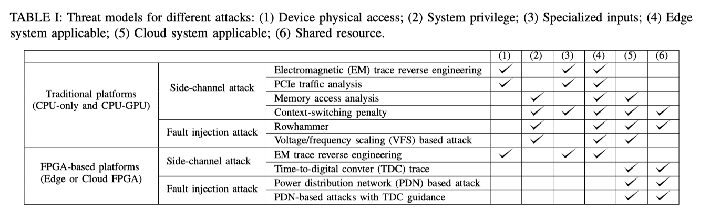

# Defending Bit Flip Attack through DNN weight reconstruction

https://dfan.engineering.asu.edu/wp-content/uploads/2020/08/DAC_2020_bfa-defense.pdf

Reconstructs weight values to be more robust against sudden changes in values due to BFA.

**Attack / threat model**: whitebox attack using gradient-based BFA (One-shot BFA) and progressive (PBFA).

**Reconstruction method** consists of **averaging** weights, quantizing and clipping it -- spreading out the damage caused by the BFA.

# Fault Injection Attacks on Deep Neural Network

https://ieeexplore.ieee.org/abstract/document/8203770

**Single bias attack** (SBA) modifies a single bias parameter and performs an untargted attack; **gradient descent attack (GDA)** causes misclassification on the target class using least number of modifications.

Evaluated on MNIST and CIFAR10.

**Threat model**: whitebox attacks and adversary can modify any value in a model -- assumes that fault injection (whether that be rowhammer or laser) is precise enough.

SBA relies on unbounded ReLU (tanh is immune to SBA). GDA can be more *stealthy* by modifying more parameters -- but smaller magnitudes in perturbations.

Assumes that bit-flips can reliably be achieved --> guarantee arbitrary parameter value changes; but focuses more on DNN's response to value changes in parameters -- not at a bit-flip granuality.

# Deep Neural Network Security From a Hardware Perspective

- Surveys and categories attacks for various hardware platforms: CPU, GPU, and FPGA; looks at emerging threat of DNN vulnerabilities from hardware threat surfaces.

- Looks at two categories of threats for DNNs: side-channel attacks to exfiltrate information from DNNs such as parameters and model architecture; fault-injection attacks to sabotage inference accuracy. (most the paper focuses on the latter).

  

- Hardware attacks are claimed to be more stealthy than input-based attacks

- Describes other fault injection attacks such as voltage/frequency scaling (VFS) in CPU/GPU, and power distrbution network (PDN) vulnerability on FPGAs when multiple tenents reside ons the same FPGA chip to induce logic/memory corruption.

# POSTER: Practical Fault Attack on Deep Neural Networks

- Untargted attack on DNNs' activation functions (sigmoid, Relu, softmax, and tanh) to achieve untargeted misclassificaiton -- but how (?)
- Uses laser fault injection
- Evaluated not with any DNN or dataset, but on emulated activation function execution on Arduino.